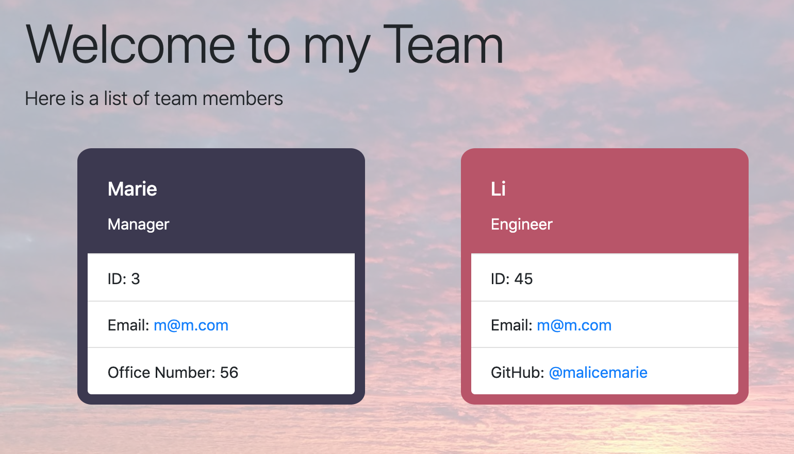

# TemplateEngine

Unit 10 OOP Homework: Template Engine - Employee Summary

## Directions

1. Run node app.js
1. Follow the prompts to add your team memeber
1. Choose if you would like to add additional team members
1. When you are finished answer "No" & your html file will be ready!

## User Story

As a recruiter or manager, I want an easy way to view members of a team, so I can interview and plan candidates accordingly.

I am able to access email and GitHub pages quickly from the team html page

## Modules

fs and all the related modules needed to run the app.js file should be included in the package.json file.

## Preview

